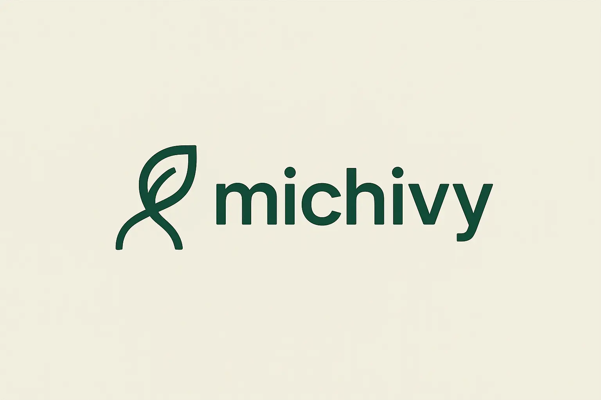

<div align="center">
	<div>
		
	</div>
</div>

Michibi is something


## Install
```sh
npm i @michivy/react
```

## Usage
### Default
```ts
const buttonRef = useRef<HTMLButtonElement>(null);

return (
  <Michivy
    name="tour1"
    steps={[
      // query is available.
      { target: "#sample1", content: "tour1" },
      // Also xpath is available.
      { target: '//*[@id="sample2"]', content: "tour2" },
      // Also React ref is available.
      { target: buttonRef.current, content: "tour3" },
    ]}
  >
    <button type="button" ref={buttonRef}>
      sample3
    </button>
  </Michivy>
);
```

### Hook
```ts
const { currentTour, stepIndex, skip } = useTour();

return (
  <div>
    <p>current tour is {currentTour}</p>
    <p>current step is {stepIndex}</p>
    <button type="button" onClick={skip}>
      Skip
    </button>
  </div>
);
```

### Type Safe
```jsx
const {
	Michivy: Mychivy,
	MichivyProvider: MychivyProvider,
	useTour: useMyTour,
} = createMichivy<"tour1" | "tour2">();

function Sample() {
	// type safe!
	const tour = useMyTour("tour1");

	return (
		<MychivyProvider
			// type safe!
			initialTours={{ tour1: [{ target: "#sample1", content: "content1" }] }}
		>
			<Mychivy
				// type safe!
				name="tour1"
				steps={[{ target: "#sample1", content: "content1" }]}
			/>
		</MychivyProvider>
	);
}
```

### Provider
By default it is providerless, but you can use a provider. In this case, you can control different tours for each provider.
```jsx
<MichivyProvider
  initialTours={{
    tour1: [
      { target: ".sample1", content: "content1" },
      { target: ".sample2", content: "content2" },
    ],
    tour2: [
      { target: ".sample3", content: "content3" },
      { target: ".sample4", content: "content4" },
    ],
  }}
>
  ...
</MichivyProvider>
```